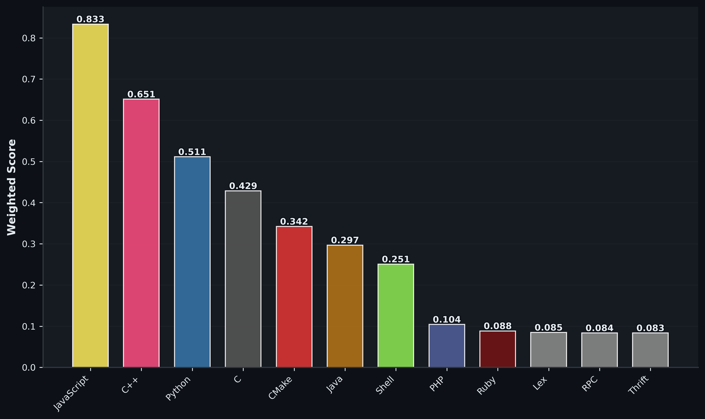
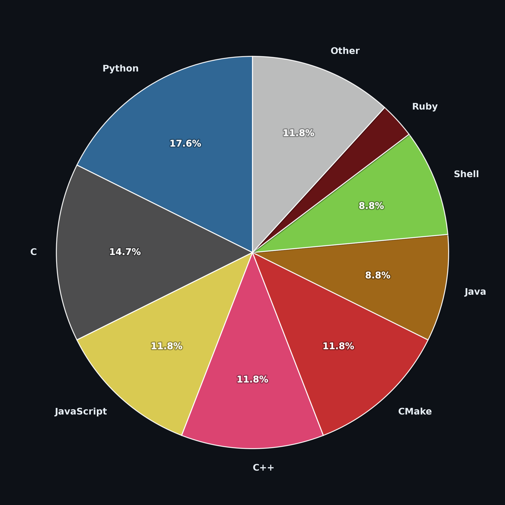

# Hola, soy Zapi 👋

  <h3>Estudiante de Ingeniería Informática | Especializado en Desarrollo y Despliegue de Software</h3>

---

## Sobre mí

* Estudiante de Ingeniería Informática en la Universidad de Granada (UGR).
* Actualmente formo parte del equipo de la Oficina de Software Libre de la UGR (OSL Granada).
* Especializado con mención en Ingeniería de Software.
* Firme defensor de la filosofía open-source.
* Siempre abierto a explorar nuevas tecnologías y colaborar en todo tipo de proyectos.

---

## 📊 Lenguajes más utilizados

Estas estadísticas se generan de forma automática analizando todo el código de mis repositorios:

| Ranking Ponderado (Código y Repos) | Uso según número de Repositorios |
| :---: | :---: |
|  |  |

---

## Muchas de las tecnologías que he usado 😜
(Pon el ratón sobre ellas para descubrir más)
### 👨‍💻 Lenguajes de Programación

  
  
  
  
  
  
  
  
  

### 🌐 Desarrollo Web y Frameworks

  
  
  
  
  
  
  

### ⚙️ Sistemas y Bases de Datos

  
  
  
  
  
  
  
  

### 🧰 Herramientas y Entornos

  
  
  
  
  
  

---

Para saber más sobre mis proyectos puedes revisar cualquiera de mis repositorios públicos.

**¡Muchas gracias por tu tiempo!**
