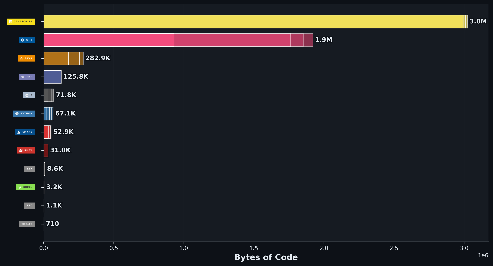

# Hola, soy Zapi 👋

**Estudiante de Ingeniería Informática | Especialista en Desarrollo y Despliegue de Software**

---

## 👨‍💻 Sobre mí

* Estudiante de Ingeniería Informática en la Universidad de Granada (UGR).
* Actualmente formo parte del equipo de la Oficina de Software Libre de la UGR (OSL Granada).
* Especializado con mención en Ingeniería de software.
* Firme defensor de la filosofía open-source.
* Siempre abierto a explorar nuevas tecnologías y colaborar en todo tipo de proyectos.

---

## 📊 Lenguajes más utilizados

Estas estadísticas se generan de forma automática analizando todo el código de mis repositorios:

---

Para saber más sobre mis proyectos puedes revisar cualquiera de mis repositorios públicos.

**¡Muchas gracias por tu tiempo!**
